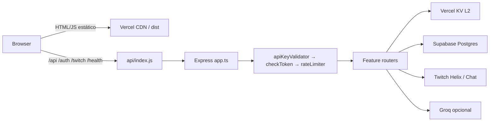
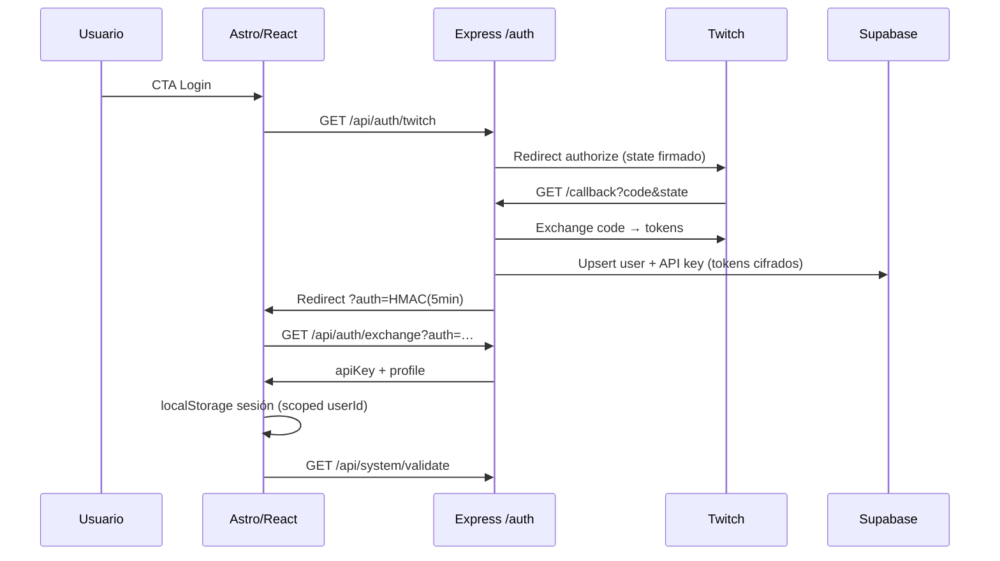
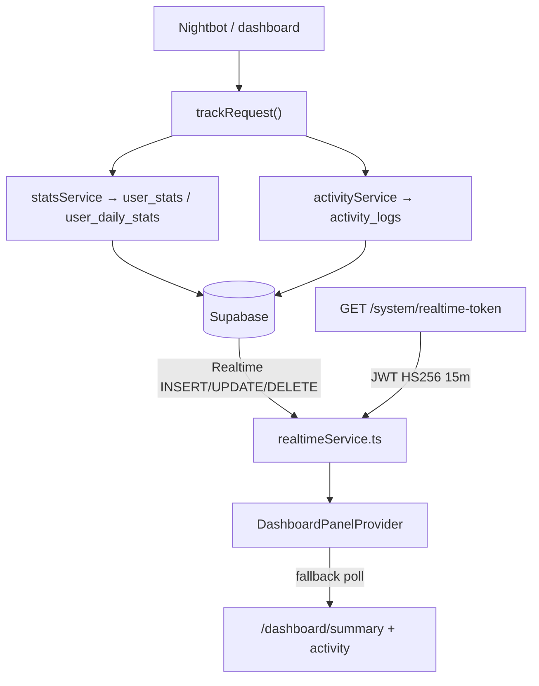
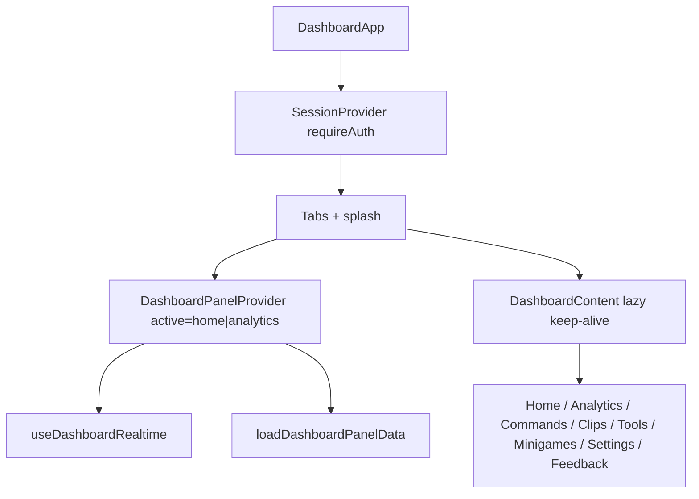

# DOCUMENTATION.md — LosPerris Twitch API (v5)

Documentación técnica completa del proyecto: arquitectura, flujos, contratos y lógica por archivo.

**Producción:** https://ttv.losperris.dev  
**Código:** `twitch_api/` (este directorio)  
**Complementos:** [README.md](README.md) (inicio rápido) · [ARCHITECTURE.md](ARCHITECTURE.md) (contratos, deuda y checklist de deploy)

> Generado a partir del código fuente actual. Si un detalle de un archivo entra en conflicto con una API viva, prevalece el código.

---

## Tabla de contenidos

1. [Qué es el proyecto](#1-qué-es-el-proyecto)
2. [Stack tecnológico](#2-stack-tecnológico)
3. [Estructura del repositorio](#3-estructura-del-repositorio)
4. [Flujos de datos (diagramas)](#4-flujos-de-datos-diagramas)
5. [Autenticación y credenciales](#5-autenticación-y-credenciales)
6. [Mapa de endpoints API](#6-mapa-de-endpoints-api)
7. [Base de datos, caché y realtime](#7-base-de-datos-caché-y-realtime)
8. [Backend — lógica por archivo](#8-backend--lógica-por-archivo)
9. [Frontend — lógica por archivo](#9-frontend--lógica-por-archivo)
10. [Variables de entorno](#10-variables-de-entorno)
11. [Tests, CI y deploy](#11-tests-ci-y-deploy)
12. [Convenciones y deuda técnica](#12-convenciones-y-deuda-técnica)

---

## 1. Qué es el proyecto

**LosPerris Twitch API** es un producto para streamers:

- **API compatible con bots** (Nightbot, StreamElements, Fossabot, Wizebot): comandos como followage, shoutout, create-clip, send-message y minijuegos, respondiendo en **texto plano**.
- **Dashboard autenticado** con OAuth de Twitch: analytics en tiempo real, home con actividad, clips, generadores de comandos, herramientas (ruleta, tendencias, stalker), minijuegos, settings y feedback.
- **Overlays OBS** (ruleta y tendencias) con token de lectura firmado, sin exponer la API key maestra.
- **Docs públicas** y landing de marketing.

Arquitectura de despliegue:

| Capa | Tecnología |
|------|------------|
| UI estática | Astro 6 (static) + React 19 islands + Tailwind 4 |
| API | Express 5 compilado a `api/_bundle/` y servido como Vercel Function |
| Persistencia | Supabase (Postgres) |
| Caché / rate limit | Vercel KV (Redis) + L1 en RAM del proceso |
| IA opcional | Groq (`GROQ_API_KEY`) — Bola 8 |

**No usa** Cloudflare Workers, Wrangler, D1 ni Durable Objects.

---

## 2. Stack tecnológico

| Área | Librerías / herramientas |
|------|--------------------------|
| Runtime | Node ≥ 22.12, pnpm 9.15.9 |
| Frontend | Astro, React, Lucide, Recharts, Sonner, Lenis, tmi.js, @dnd-kit |
| Backend | Express, Zod, Helmet, JWT, Winston, axios, axios-retry |
| Auth | Twitch OAuth 2, HMAC exchange tokens, UUID API keys, overlay HMAC, JWT Realtime |
| Client DB | `@supabase/supabase-js` (service role en server; anon + JWT en browser Realtime) |
| Deploy | Vercel (`vercel.json`, `api/index.js`) |
| Calidad | ESLint, Astro check, tsc, Jest, Playwright, Husky, GitHub Actions |

Scripts principales (`package.json`):

| Script | Función |
|--------|---------|
| `pnpm dev` | Astro `:4321` + Express `:3000` en paralelo |
| `pnpm build` | `tsc` backend → `prepare-api-entry` → `astro build` |
| `pnpm start` | Ejecuta `api/_bundle/serverless.js` |
| `pnpm type-check` / `lint` / `test` / `test:e2e` | Calidad |
| `pnpm smoke` | Checklist manual de producción |
| `pnpm check-env` | Valida `.env` antes de arrancar la API |

---

## 3. Estructura del repositorio

```text
twitch_api/
├── api/                      # Entry Vercel → Express compilado
│   ├── index.js              # require('./_bundle/serverless.js')
│   └── _bundle/              # Salida de tsc (backend)
├── backend/src/              # Código fuente de la API Express
├── src/                      # Frontend Astro + React (feature-based)
├── public/                   # PWA (sw.js, manifest), assets
├── tests/                    # Jest (backend + frontend)
├── e2e/                      # Playwright
├── scripts/                  # check-env, prepare-api-entry, smoke, SQL Supabase
├── vercel.json
├── astro.config.mjs
├── package.json
├── README.md
├── ARCHITECTURE.md
└── DOCUMENTATION.md          # Este archivo
```

### Frontend (`src/`)

```text
src/
├── core/           # Infra transversal (API client, sesión, config, UI helpers)
├── shared/         # UI reutilizable + SessionProvider + errores
├── features/       # Dominio: dashboard, commands, clips, tools, minigames, …
├── pages/          # Rutas Astro (solo wiring)
├── layouts/        # BaseLayout, DocsLayout, OverlayLayout
└── styles/         # global.css (Tailwind)
```

### Backend (`backend/src/`)

```text
backend/src/
├── app.ts / serverless.ts
├── routes/index.ts
├── core/           # config, database, middleware, startup, utils, errors
├── features/       # auth, commands, dashboard, games, system, twitch
└── types/
```

Alias de imports frontend: `@/` → `src/`.

---

## 4. Flujos de datos (diagramas)

### 4.1 Request en producción



### 4.2 OAuth y bootstrap de sesión



### 4.3 Stats + Realtime del panel



### 4.4 Shell del dashboard



---

## 5. Autenticación y credenciales

Hay **cinco** tipos de credencial:

| Credencial | Dónde vive | Para qué |
|------------|------------|----------|
| **API key (UUID)** | Header `X-Api-Key` o `?apiKey=` | Bots y la mayoría de endpoints HTTP |
| **OAuth Bearer** | `Authorization: Bearer …` | Dashboard autenticado |
| **HMAC `auth` (5 min)** | Query `?auth=` tras callback Twitch | Canje único → apiKey (`/auth/exchange`) |
| **Overlay read token** | `X-Overlay-Token` / query | OBS: lectura de estado; no es la API key |
| **Realtime JWT** | Firmado con `SUPABASE_JWT_SECRET` (15 min) | Canales Realtime del dashboard |

### Cadena de middleware por request API

1. Middleware global: scanner fast-drop → requestLogger → JSON → CSP nonce → Helmet → CORS → compression  
2. **`stripTwitchPrefix`** → `/twitch/*` → rutas canónicas (`/followage`, …)  
3. `Cache-Control: no-store` en `/api`, `/auth`, `/twitch`  
4. Health / SEO (públicos)  
5. **`apiKeyValidator`** → resuelve API key u overlay token → `res.locals.apiUser` (overlay sin secretos OAuth)  
6. **`checkToken`** → Bearer / rutas públicas  
7. **`overlayScopeGuard`** → overlay solo `GET /dashboard/overlay-state/:tool`  
8. **`globalRateLimiter`**  
9. Routers de feature (+ `csrfProtection`, Zod, limiters específicos)  
10. 404 → **`errorHandler`**

> Helmet aplica nonce CSP a HTML servido por Express. Las páginas Astro CDN usan la CSP de `vercel.json`: `script-src 'self' 'unsafe-inline'` + Speed Insights — necesario porque Astro/`client:*` inyecta scripts de hidratación inline (sin nonce en estático).

### Contratos de respuesta

- **Dashboard / system / auth exchange:** JSON  
  `{ success: false, error: { message, code, details? } }`
- **Comandos de bot:** **texto plano** (compat Nightbot), a menudo HTTP 200 incluso en errores “de negocio”

---

## 6. Mapa de endpoints API

Montados bajo `/api` (y alias `/` + `/twitch` para compat). Frontend: `src/core/config/config.ts` → `API_ENDPOINTS`.

| Prefijo | Rutas clave | Notas |
|---------|-------------|-------|
| `/health`, `/api/health` | GET | Ready / maintenance |
| `/robots.txt`, `/sitemap.xml` | GET | SEO |
| `/auth`, `/api/auth` | `/twitch`, `/twitch/callback`, `/exchange`, `/overlay-exchange` | OAuth |
| Comandos | GET `/create-clip`, `/followage`, `/shoutout`; POST `/send-message` | Texto plano |
| `/api/dashboard` | summary, analytics, activity, clips, chatters, user-info, settings, clear-data, delete-account, export-*, overlay-state, overlay-link | Panel |
| `/api/minigames` | GET `/magic8`, `/russian`, `/duel` | Minijuegos |
| `/api/system` | validate, regenerate-key, feedback, health, realtime-token | Sesión / ops |

CSRF (Origin/Referer) en mutaciones de dashboard/system/comandos POST; excepción: requests de bot/OBS **sin** Origin.

---

## 7. Base de datos, caché y realtime

### Tablas Supabase

| Tabla | Uso |
|-------|-----|
| `users` | Perfil, `apiKey`, tokens OAuth cifrados, role, timezone, `token_expires_at`, `last_active` |
| `user_stats` | Agregados + contadores por comando |
| `user_daily_stats` | Serie diaria (gráficas 7 días) |
| `activity_logs` | Feed del home (trim ~50) |
| `audit_logs` | Acciones sensibles (regenerar key, etc.) |
| `system_logs` | Logs warn/error vía Winston transport |

RPCs relevantes: `log_user_request` (o equivalente `record_user_request` en SQL de optimización), `trim_activity_logs`. Ver `scripts/supabase/optimizations.sql`.

### Caché en 3 capas

| Capa | Dónde | Uso |
|------|-------|-----|
| **L1** | RAM del proceso (`BoundedMap`, `userMemoryCache`; RL solo fallback) | 0 ops KV en bots calientes |
| **L2** | Vercel KV (`twitch_api:` prefix) | Meta de API key **sin** tokens OAuth, overlays, rate limits, revisions |
| **L3** | Supabase | Source of truth |

TTLs: `backend/src/core/config/cacheTtl.ts` (matriz por recurso y rol).  
Invalidación masiva: `invalidateAllUserCaches()` al borrar stats, regenerar key o eliminar cuenta.

### Realtime (frontend)

1. Panel pide JWT en `/api/system/realtime-token/`.  
2. `realtimeService.ts` usa cliente anon Supabase + `setAuth(jwt)`.  
3. Canales filtrados por `user_id` en `activity_logs`, `user_stats`, `user_daily_stats`.  
4. Solo pestaña **líder** (`TabSyncService`) hace fetch/poll agresivo; Realtime activo en tabs Home/Analytics.  
5. Fallback: poll 90s (con RT) / 8s (sin RT) + safety 120s.

---

## 8. Backend — lógica por archivo

Rutas relativas a `backend/src/`.

### 8.1 Entrypoints y router

#### `app.ts`
Compone Express: `validateConfig` → `configureMiddleware` → `configureRoutes`. Exporta `app`. Sin static frontend (Astro es otro proceso).

#### `serverless.ts`
Reexporta `app`. Si corre como main: `listen(PORT||3000)`. Entry usado por Vercel vía `api/_bundle/serverless.js`.

#### `routes/index.ts`
Monta:
- `/minigames` → games  
- `/dashboard` → dashboard  
- `/system` → system  
- *(sin prefijo)* → commands  

Evita un `use('/')` vacío que capturaría health.

### 8.2 Startup (`core/startup/`)

| Archivo | Lógica |
|---------|--------|
| `config-check.ts` | Confirma que `env.ts` ya validó; log de arranque |
| `middleware.ts` | Trust proxy, fast-drop scanners, logger, JSON, CSP nonce, Helmet, Permissions-Policy, CORS (`ALLOWED_ORIGINS`), compression; registra invalidator de API key |
| `routes.ts` | Orden completo health/SEO → apiKey → checkToken → rateLimit → auth → apiRouter → 404 → errorHandler |

### 8.3 Config (`core/config/`)

| Archivo | Lógica |
|---------|--------|
| `env.ts` | Dotenv + Zod → `CONFIG`. En Vercel corrige localhost → `ttv.losperris.dev`. Exit 1 si env inválido (salvo `ALLOW_INVALID_ENV`) |
| `origins.ts` | Allowlist CORS/CSRF + `isPanelBrowserRequest` |
| `limits.ts` | Constantes numéricas de rate limit |
| `cacheTtl.ts` | Matriz TTL por recurso/rol + `ownerScopedCacheKey` |
| `userRoles.ts` | Roles `default|pro|vip|partner`, labels y límites |
| `messages.ts` | Mensajes ES centralizados (AUTH, COMMANDS, DASHBOARD, …) |

### 8.4 Errores y middleware (`core/errors`, `core/middleware/`)

| Archivo | Lógica |
|---------|--------|
| `AppError.ts` | `AppError` / `TwitchApiError` operacionales |
| `apiKeyValidator.ts` | Overlay token o API key → L1+KV+DB; refresh OAuth si cerca de expirar; `invalidateUserCache` |
| `authMiddleware.ts` | Bearer; rutas públicas; negative cache; throttle `last_active`; suspendidos → 403 |
| `redisRateLimiter.ts` | KV + fallback RAM; `global` / `auth` / `heavy` / anti-scan unauth |
| `csrfProtection.ts` | Origin/Referer en mutaciones; bots sin Origin OK |
| `validate.ts` | Middleware Zod; redacta secretos en logs |
| `errorMiddleware.ts` | `requestLogger` + `errorHandler` (bots → texto; HTML → redirect 404/429/500) |
| `cspNonce.ts` | Nonce por request HTML; vacío en API |

### 8.5 Database (`core/database/`)

| Archivo | Lógica |
|---------|--------|
| `supabaseClient.ts` | Cliente **service role** (bypass RLS) |
| `dbService.ts` | Fachada `export *` de crypto/audit/activity/stats/user + supabase |
| `cryptoService.ts` | AES-256-GCM (`gcm:iv:tag:ct`); decrypt legacy CBC + migración al leer; clave SHA-256(`ENCRYPTION_KEY`) |
| `userService.ts` | CRUD users, cifrado tokens, L1/KV, migración legacy, update timezone/last_active |
| `statsService.ts` | get/record/clear stats; RPC `log_user_request`; “hoy” por timezone; bump `stats:rev` |
| `activityService.ts` | Insert/list/trim activity; ignora `ANONYMOUS_USER_ID` |
| `auditService.ts` | `system_logs` + `audit_logs` |
| `cacheService.ts` | L1 Map + KV get/set/del; meta API key; revision; revoke; fail-soft |
| `userTimezoneCache.ts` | TZ en RAM para stats sin SELECT circular |

### 8.6 Utils (`core/utils/`)

| Archivo | Lógica |
|---------|--------|
| `logger.ts` | Winston + ALS requestId + transport Supabase con circuit breaker |
| `tracking.ts` | `trackRequest(action)` → stats + activity en background (`.catch` en logger, no bloquea respuesta bot) |
| `cacheInvalidation.ts` | Orquesta nuke multi-capa (+ revoke API key) |
| `routeHelpers.ts` | `isPublicRoute`, `isJsonApiRoute`, `isBotCommand`, … |
| `twitchAuthHelpers.ts` | `withTwitchAuth` con retry refresh en 401 |
| `frontendPaths.ts` | URLs absolutas al Astro (`FRONTEND_URL` / origin `BASE_URL`) |
| `jsonResponse.ts` | `jsonError` unificado |
| `validationHelpers.ts` | `safeString`, `sanitizeHtml` |
| `time.ts` | `getTimePhraseBetween` (followage ES) |
| `boundedCache.ts` | `BoundedMap` + `NegativeCache` |
| `dashboardProfile.ts` | Perfil panel puro desde Helix + límites |

### 8.7 Auth feature (`features/auth/`)

| Archivo | Lógica |
|---------|--------|
| `auth.routes.ts` | GET twitch / callback / exchange / overlay-exchange |
| `auth.controller.ts` | Redirects, allowlist `redirect_origin`, handlers HTTP |
| `auth.service.ts` | State HMAC, code exchange, persist user, API key regen, overlay tokens, refresh OAuth (dedupe, buffer 30m), verify/sign exchanges |
| `auth.schema.ts` | Zod de query params |

### 8.8 System (`features/system/`)

| Archivo | Lógica |
|---------|--------|
| `system.routes.ts` | validate, regenerate-key, feedback, health, realtime-token |
| `system.controller.ts` | Validate sesión; regen key + audit; Discord feedback; health paralelo DB/KV/Twitch; JWT Realtime HS256 15m |
| `system.schema.ts` | Feedback 1–2000 chars |
| `seo.controller.ts` | robots.txt / sitemap.xml cacheables |

### 8.9 Commands (`features/commands/`)

| Archivo | Lógica |
|---------|--------|
| `commands.routes.ts` | clip / followage / shoutout / send-message |
| `commands.controller.ts` | Helix + templates `{url}`/`{time}` + `trackRequest` + text/plain |
| `commands.schema.ts` | Usernames Twitch + límites de template |

### 8.10 Dashboard (`features/dashboard/`)

| Archivo | Lógica |
|---------|--------|
| `dashboard.routes.ts` | summary, analytics, activity, clips, chatters, settings, clear, delete, export, overlay |
| `dashboard.controller.ts` | Analytics con `_statsRev`; export cooldown KV; clear/delete orquestados |
| `dashboard.schema.ts` | Confirmaciones `LIMPIAR`/`ELIMINAR`, eligibility, settings |
| `dashboardHelpers.ts` | Payload analytics puro + freshness |
| `overlay/controller.ts` | GET/PUT estado KV; crea link firmado OBS; write solo desde browser autenticado |
| `overlay/schema.ts` | Estado ≤64KB / ≤200 keys |
| `overlay/keys.ts` | `overlay:state:{userId}:{tool}` + paths frontend |

### 8.11 Games (`features/games/`)

| Archivo | Lógica |
|---------|--------|
| `games.routes.ts` | magic8 / russian / duel |
| `games.controller.ts` | Tracking + fallback token por canal |
| `games.schema.ts` | Moods / usernames |
| `magic8.service.ts` | Groq `llama-3.3-70b-versatile` |
| `magic8Question.ts` | Heurísticas de tipo de pregunta ES |
| `magic8Moods.ts` | Personas + temperature por mood |
| `russian.service.ts` | 1/6 muerte + timeout Helix opcional; streamer inmortal |
| `duel.service.ts` | 50/50 narrativo sin Helix |

### 8.12 Twitch (`features/twitch/`)

| Archivo | Lógica |
|---------|--------|
| `twitch.service.ts` | Barrel reexport |
| `twitchClient.ts` | Axios Helix + circuit breaker (5 fallos / 30s) + retries 429 + Discord health |
| `twitchUserService.ts` | getUserId/info/followage/validate/followers (+ caché) |
| `twitchChatService.ts` | channel, chat message, chatters, timeout, eligibility |
| `twitchClipService.ts` | createClip / getClips |

### 8.13 Types (`types/`)

| Archivo | Lógica |
|---------|--------|
| `twitch.ts` | `StoredUser`, `AuthenticatedRequest`, shapes Helix |
| `express.d.ts` | Augmenta `Request` / `Locals` (`apiUser`, `cspNonce`, flags) |
| `constants.ts` | `ANONYMOUS_USER_ID` |
| `cache.ts` | `CacheEntry<T>` |

---

## 9. Frontend — lógica por archivo

Rutas relativas a `src/`.

### 9.1 Pages y layouts

| Archivo | Rol |
|---------|-----|
| `pages/index.astro` | Landing + `LandingPage` (`client:idle`) |
| `pages/dashboard.astro` | `DashboardApp` (`client:only`) |
| `pages/docs.astro` | Docs |
| `pages/sobre-la-api.astro` | About |
| `pages/legal.astro` | Legal por hash |
| `pages/privacidad|terminos|cookies.astro` | Redirect → `/legal#…` |
| `pages/404|500.astro` | `ErrorPage` |
| `pages/429.astro` | `RateLimitPage` countdown |
| `pages/offline.astro` | Offline PWA |
| `pages/overlay/roulette|trends.astro` | OBS transparente |
| `layouts/BaseLayout.astro` | HTML, SEO, Geist, SW prod, SpeedInsights, Footer |
| `layouts/DocsLayout.astro` | Variante docs |
| `layouts/OverlayLayout.astro` | `noindex`, fondo transparente |

Tabs del panel **no** son páginas Astro: SPA bajo `/dashboard` + path `/dashboard/:tab`.

### 9.2 Core (`core/`)

#### Config
- **`config/config.ts`** — `API_ENDPOINTS`, `Session`, `DashboardTab`, Supabase anon inject, bots ignorados, `STATUS_PAGE_URL`.
- **`config/paths.ts`** — `APP_MOUNT=''`, `appPath`, legal, dashboard, return paths docs↔panel.
- **`config/pageTitle.ts`** — títulos `«Página | LosPerris»`.

#### API / sesión
- **`api/auth.ts`** — get/save/invalidate session, validate (caché fingerprint), `apiFetch` (401 refresh), login/logout, BroadcastChannel, splash flags.
- **`api/authQuery.ts`** — `apiKey`/`token` query para pruebas de comandos.
- **`api/apiError.ts`** — `extractApiErrorMessage` (JSON unificado + legacy).
- **`api/fetchWithRetry.ts`** — reintento en 5xx (cold start).
- **`session/context.ts`** — Context único.
- **`session/useSession.ts`** — hooks `useSession` / `useRequiredSession`.
- **`session/useProactiveTokenRefresh.ts`** — refresh ~35 min antes de `tokenExpiresAt`.
- **`session/localPrefs.ts`** — prefs scoped por userId + migración.
- **`session/loadProgress.ts`** — eventos de progreso para splash.

#### Otros core
- **`cache/cacheService.ts`** — L1 browser TTL 60s.
- **`errors/rateLimitCooldown.ts`** — cooldown UI 429.
- **`logging/logError.ts` / `debugLog.ts`** — errores globales / logs solo en dev.
- **`types/twitch.ts`** — tipos UI Twitch/Stalker/Roulette.
- **`ui/tw.ts` / `docsTw.ts` / `animateValue.ts` / `clipboard.ts` / `utils.ts`** — clases, animación, clipboard, mask key.

### 9.3 Shared (`shared/`)

| Archivo | Rol |
|---------|-----|
| `providers/SessionProvider.tsx` | Bootstrap sesión (panel u overlay); redirect si `requireAuth` |
| `layout/Footer.tsx` | Links legales (+ offset dashboard) |
| `errors/ErrorPage.tsx` / `RateLimitPage.tsx` | UI error / 429 |
| `ui/ToastProvider.tsx` | Sonner → `showToast` |
| `ui/Modal.tsx` | Base / DangerConfirm / RegenKey |
| `ui/Dropdown|Accordion|SelectField|InfoTooltip|Skeleton|AnimatedNumber|Icon|AppLogo|ErrorBoundary` | Primitives |
| `ui/LoginDisclaimerModal|VerifyingSessionModal|UserInspectModal|OnlineStatusMonitor` | Flujos UX |
| `ui/icons/BrandIcons.tsx` | Twitch/Discord/Instagram/PayPal |

### 9.4 Dashboard (`features/dashboard/`) — corazón del panel

#### App y provider
- **`app/DashboardApp.tsx`** — Toast + Session + Sidebar/Header/Content; `DashboardPanelProvider` activo en `home|analytics`; splash hasta `dashboard:data-ready`; ping `/api/health`.
- **`providers/DashboardPanelProvider.tsx`** — Fuente de verdad de `stats` / `activity` / `profile`; Realtime + poll (solo líder TabSync); midnight rollover; highlights 3s; `syncLabel`; reset vía eventos; 401 realtime → logout.
- **`hooks/useDashboardRealtime.ts`** — Lazy import Realtime; `{ isLive }`.
- **`hooks/useMountedTabs.ts`** — Keep-alive de tabs visitadas.

#### Libs
| Archivo | Rol |
|---------|-----|
| `lib/realtimeService.ts` | Cliente Supabase compartido, JWT, canales, reconnect, cooldown 5m |
| `lib/dashboardStats.ts` | `DashboardLiveStats`, parse/merge, `getTodayRequestsTotal`, patches diarios |
| `lib/loadDashboardPanelData.ts` | Parallel summary/activity/profile; freshness date |
| `lib/dashboardSummary.ts` | Fetch SUMMARY / USER_INFO |
| `lib/dashboardSync.ts` | Intervalos poll + broadcast reset home |
| `lib/tabSyncService.ts` | Líder por heartbeat BroadcastChannel |
| `lib/dashboardTabs.ts` | `NAV_ITEMS` / `TAB_META` |
| `lib/dashboardTabUrl.ts` | Resolve/set tab (path > hash > query > last) |
| `lib/activityLogDisplay.ts` / `activityLogFilter.ts` | Iconos/filtros del feed |
| `lib/dashboardPanelEvents.ts` | `DASHBOARD_DATA_READY_EVENT` |
| `lib/dataExporter.ts` | Export HTML + check/complete API |

#### Views
- **`components/DashboardContent.tsx`** — Lazy switch + `hidden` keep-alive + ErrorBoundary.
- **`layout/Sidebar.tsx` / `DashboardHeader.tsx`** — Nav y header de usuario.
- **`home/HomeView.tsx`** — Perfil + feed + recursos.
- **`home/HomeActivityFeed.tsx` / `HomeActivityLogEntry.tsx` / `HomeResourcesPanel.tsx`** — Feed filtrable y atajos.
- **`analytics/AnalyticsView.tsx`** — KPIs + Recharts; `ChartMountGate` evita charts 0×0; tooltips InfoTooltip.
- **`settings/*`** — Hero, security (API key), preferences (TZ), export, danger zone (clear/delete).

### 9.5 Commands / Clips / Minigames

| Módulo | Archivos clave | Lógica |
|--------|----------------|--------|
| Commands | `CommandsViews`, `CommandGeneratorCard`, `config`, `commandGenerator`, `commandStore`, `useCommandStore` | Genera URLs Nightbot/SE/…; prueba HTTP; store persistido por user |
| Clips | `ClipsView`, `ClipPlayerOverlay`, `clipEmbed` | Lista Helix + favs localStorage + embed parents |
| Minigames | `MinigamesViews` | Cards Magic8 / Duel / Russian + test contra API |

### 9.6 Tools (ruleta, trends, stalker, overlay)

#### Ruleta
- `RouletteView` + `useRouletteController`: chatters Helix + TMI + spin canvas + announce + publish overlay.
- `RouletteWheelDisplay` / `WheelPointer` / eligibility / `wheelUtils`.

#### Tendencias
- `TrendsView` + `useTrendsController`: cuenta palabras TMI (stopwords/bots), timer, TabSync líder, ranking.
- `TrendsLeaderboardDisplay` / `TrackerRow` / `rankWordCounts`.

#### Stalker
- `StalkerView`: chatters + TMI highlights + `UserInspectModal` + `chatLogStore`.

#### Overlay OBS
- Apps: `OverlayRouletteApp` / `OverlayTrendsApp`.
- `OverlaySessionProvider` + Gate: sesión solo overlay (token URL / sessionStorage).
- `useOverlayMirror` (poll) / `useOverlayPublish` (debounce PUT).
- `sync.ts`, `overlayApi.ts`, `credentials.ts`, `overlaySession.ts`, `types.ts`, banners y setup guide.

### 9.7 Chat

- **`tmiService.ts`** — Singleton TMI lazy, identity OAuth opcional, refcount listeners.
- **`useTmiChat.ts`** — Hook enable/cleanup.
- **`chatLogStore.ts`** — Buffer 500 msgs para inspect.

### 9.8 Docs / Marketing / About / Legal / Feedback

| Feature | Rol |
|---------|-----|
| `docs/*` | Docs interactivas: sidebar, anclas, tabs de bots, overlays |
| `marketing/LandingPage.tsx` | Landing animada + OAuth + splash redirect |
| `about/*` | Historia + tech cards |
| `legal/*` | Hub hash privacidad/términos/cookies |
| `feedback/FeedbackView.tsx` | POST feedback (+ anonymous) |

---

## 10. Variables de entorno

### Obligatorias (API / `CONFIG`)

| Variable | Uso |
|----------|-----|
| `TWITCH_CLIENT_ID` / `TWITCH_CLIENT_SECRET` | OAuth + Helix |
| `ENCRYPTION_KEY` (≥32) | Cifrado tokens at rest (AES-GCM) |
| `HMAC_SIGNING_SECRET` (≥32) | Firmas state / auth exchange / overlay — **obligatorio en producción** |
| `SUPABASE_URL` / `SUPABASE_SERVICE_ROLE_KEY` | DB server |
| `SUPABASE_ANON_KEY` | Inyectada al frontend (Realtime) |
| `SUPABASE_JWT_SECRET` | JWT Realtime |
| `TWITCH_REDIRECT_URI` | Callback OAuth |
| `BASE_URL` | Canonical API |
| `FRONTEND_URL` | Redirects Astro |

### Importantes opcionales / plataforma

| Variable | Uso |
|----------|-----|
| `KV_REST_API_URL` / `KV_REST_API_TOKEN` | Vercel KV (prod) |
| `GROQ_API_KEY` | Bola 8 |
| `DISCORD_FEEDBACK_WEBHOOK_URL` / `DISCORD_HEALTH_WEBHOOK_URL` | Feedback / circuit breaker |
| `PORT`, `NODE_ENV`, `LOG_LEVEL`, `LOG_VERBOSE` | Runtime / logs |
| `VERCEL`, `VERCEL_ENV`, `VERCEL_REGION` | Meta plataforma |
| `ALLOW_INVALID_ENV` | Arranque con env inválido (no prod) |

Checklist prod detallado: [ARCHITECTURE.md](ARCHITECTURE.md).

---

## 11. Tests, CI y deploy

### Tests
- **Jest** (`jest.config.js`): proyectos backend (`tests/**`) y frontend (`tests/unit/frontend/**`) — ~364 tests.
- **Playwright** (`e2e/`): smoke UI con mocks de panel + checks API.
- Cobertura típica: middleware, controllers, stats/tracking, realtime, dashboardStats, SessionProvider, etc.

### CI (`.github/workflows/ci.yml`)
`install → lint → type-check → test → build` y job e2e. URLs canónicas `ttv.losperris.dev`. `pnpm audit --audit-level=high` es bloqueante en CI.

### Husky
- Pre-commit: lint + type-check  
- Pre-push: test  

### Deploy Vercel
1. `pnpm build` → `dist/` (Astro) + `api/_bundle/` (Express).  
2. `vercel.json` reescribe `/api/*`, `/auth/*`, `/twitch/*`, `/health` → `api/index.js`; SPA tabs `/dashboard/:tab`; headers HSTS/CSP/cache SW.  
3. Astro en dev proxea API a `:3000` (`astro.config.mjs`).

---

## 12. Convenciones y deuda técnica

### Convenciones
- Features frontend ↔ backend alineados por dominio.
- Imports: `@/core`, `@/shared`, `@/features/…` — evitar cruces relativos raros.
- Bots = text/plain; panel = JSON unificado.
- Paths canónicos en raíz del subdominio (`APP_MOUNT = ''`), no `/api/twitch/` legacy.

### Deuda conocida (ver también ARCHITECTURE.md)
- Subir a pnpm 11 (breaking).
- (Cerrado) Rate limit dashboard OAuth ya usa KV (`rl:sess:`) como bots; L1 solo fallback.
- CORS/CSP allowlist canónica: `ttv.losperris.dev` + localhost (sin previews Vercel stale).
- Algunos hints Recharts `Cell` deprecados.
- Carpeta `docs/` local (gitignore) para notas de agentes.

---

## Apéndice A — Orden mental de un request de bot

1. Nightbot llama `GET /api/followage?apiKey=…&user=…`  
2. `apiKeyValidator` resuelve usuario (L1 → KV → Supabase) y token OAuth válido.  
3. Rate limit por API key.  
4. Controller + `withTwitchAuth` → Helix followage.  
5. `trackRequest` escribe stats/activity.  
6. Respuesta texto plano al chat.

## Apéndice B — Orden mental del panel Analytics

1. Usuario en `/dashboard/analytics` con sesión válida.  
2. `DashboardPanelProvider` carga summary/activity; suscribe Realtime si es líder.  
3. `user_daily_stats` / `user_stats` empujan patches → `mergeDashboardStats`.  
4. `AnalyticsView` anima KPIs y monta Recharts solo con tamaño real (`ChartMountGate`).  
5. Si Realtime cae: poll REST según `dashboardSync` + label “Realtime” / “Sincronizando…”.

## Apéndice C — Tipos clave

| Tipo | Ubicación | Rol |
|------|-----------|-----|
| `StoredUser` | `backend/.../types/twitch.ts` | Usuario DB |
| `AuthenticatedRequest` | idem | Request con `userId` |
| `Session` | `src/core/config/config.ts` | Sesión browser |
| `DashboardTab` | idem | IDs de navegación |
| `DashboardLiveStats` / `RealtimeStatsUpdate` | `dashboardStats.ts` | Stats panel + patches |
| `ActivityLogItem` | `activityLogDisplay.ts` | Filas del feed |
| `CacheEntry<T>` | `backend/types/cache.ts` | Entrada L1 |

---

*Fin de DOCUMENTATION.md. Para checklists de deploy y deuda viva, mantener sincronizado con ARCHITECTURE.md.*
