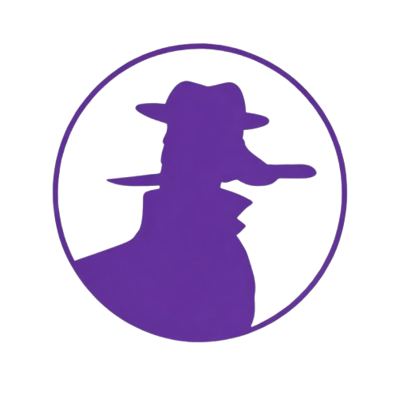
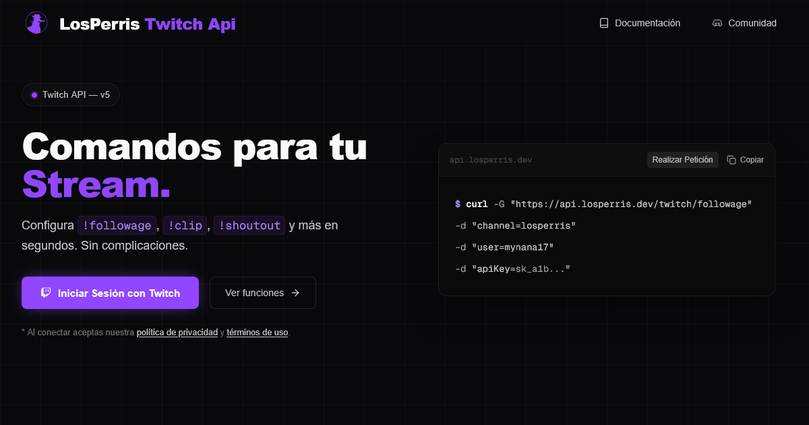

  
  <h1>Twitch API & Streamer Dashboard</h1>
  
<strong>An end-to-end ecosystem for Twitch stream management, chat moderation, and interactive overlays.</strong>

  

    
    
    
    
    
  

 

  

 

This repository serves as a **technical showcase** of software architecture, security practices, and full-stack development within the Twitch API ecosystem.

> **⚠️ Source-Available:** This code is distributed under an All Rights Reserved license, strictly for auditing and portfolio purposes. You may **not** copy, use, fork, or deploy it. See [`LICENSE`](./LICENSE) for details.

---

## Table of Contents

- [Feature Set](#comprehensive-feature-set)
- [System Architecture](#system-architecture)
- [Security Implementation](#security-implementation)
- [Testing & CI/CD](#testing--cicd-pipeline)
- [Contributing](#contributing)
- [License](#license)

---

## Comprehensive Feature Set

Unlike standard chat bots, this project is a complete platform that acts as the central nervous system for a Twitch broadcast.

| Feature Category | Description |
| :--- | :--- |
| **Broadcaster Dashboard** | Centralized management portal with secure Twitch OAuth authentication and dynamic UI theming (Light/Dark/Matrix). |
| **Internationalization (i18n)** | The platform's default language is Spanish, but includes native i18n support to switch languages dynamically from the settings. |
| **Interactive Minigames** | Built-in chat modules like the Roulette betting system and Follow-Stalker. |
| **OBS Integration** | Chroma-ready, transparent web views designed to be injected directly as Browser Sources in OBS Studio for live alerts. |
| **Bot Synchronization** | Native bi-directional integration with Nightbot and StreamElements to prevent command collision. |

---

## System Architecture

Built using a **Serverless Modular Monolith** pattern, the system balances development velocity with strict domain isolation.

| Layer | Technologies Used | Purpose |
| :--- | :--- | :--- |
| **Frontend** | Astro.js, React.js, Tailwind | Hyper-fast SSR routing (Astro) combined with interactive client-side islands (React) for the Dashboard. |
| **Backend API** | Express.js (Node.js) | Domain-Driven Design (DDD) encapsulating Auth, Commands, and Minigames into autonomous modules. |
| **Database** | PostgreSQL (Supabase) | Primary relational data storage secured by strictly enforced Row Level Security (RLS) policies. |
| **State & Cache** | Redis (Vercel KV) | Handles ephemeral state, memory caching, and role-based rate limiting to prevent API abuse. |

---

## Security Implementation

Handling live Twitch interactions and OAuth tokens requires rigorous security measures at the infrastructure level.

| Protection | Implementation Detail |
| :--- | :--- |
| **Token Encryption** | Sensitive OAuth tokens are encrypted at the application level using authenticated cryptography before database insertion. |
| **Row Level Security** | Database queries are bounded by Postgres RLS, ensuring users can only interact with their own channel's data. |
| **HMAC Signatures** | The OAuth flow is protected against MitM and replay attacks using cryptographically signed state parameters. |
| **Anti-CSRF** | Stateful requests are strictly validated against origin headers to prevent Cross-Site Request Forgery. |

For vulnerability reports, please read the [Security Policy](./SECURITY.md) before reaching out.

---

## Testing & CI/CD Pipeline

Reliability is non-negotiable for live streaming tools. The repository enforces a strict continuous integration pipeline:

- **Unit & Integration:** Over 70 Jest test suites validating everything from cryptographic injectors to core routing logic.
- **End-to-End (E2E):** Playwright is utilized to simulate full browser sessions, testing the Twitch OAuth flow.
- **Static Analysis:** Husky Git hooks prevent any commit that fails `@typescript-eslint` rules or TypeScript compilation.

---

## Contributing

This is a **Source-Available** repository. While the codebase is closed for personal or commercial use, we welcome community contributions for improvements and bug fixes.

| What | Accepted? |
| :--- | :---: |
| Bug fixes or improvements via PR | ✅ |
| Bug reports (via GitHub Issues) | ✅ |
| Security vulnerabilities | ✅ (see [SECURITY.md](./SECURITY.md)) |
| Questions / technical discussion | ✅ |

Please read [`.github/CONTRIBUTING.md`](./.github/CONTRIBUTING.md) before opening an issue.

---

## License

Copyright © 2025–2026 [losperris.dev](https://losperris.dev). All Rights Reserved.

This repository is **Source-Available** — viewing is permitted; using, copying, forking, or deploying is not. See the full [`LICENSE`](./LICENSE) for details.
