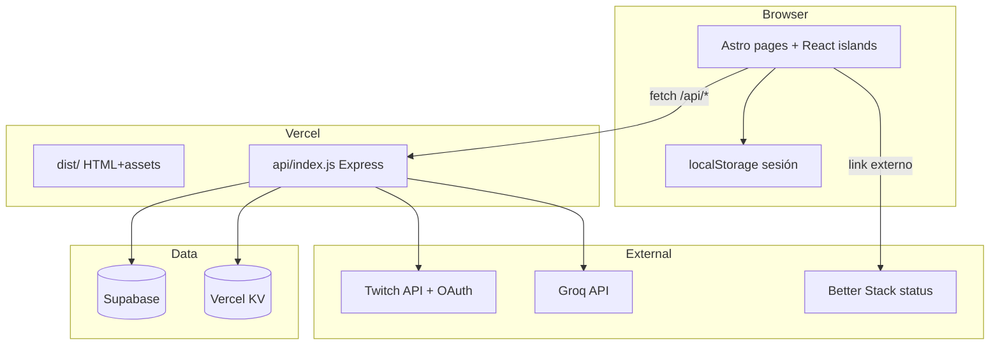

# Contexto del proyecto — LosPerris Twitch API

Documento pensado para **alimentar a una IA** (Cursor, ChatGPT, etc.) antes de tocar código. Resume stack, arquitectura, convenciones y trampas habituales.

**Versión del repo:** `twitch_api@5.x` · monorepo en `twitch_api/` (el v4 legacy vive en `legacy/`, no tocar).

---

## Qué es este proyecto

API y panel web para streamers de Twitch. Permite:

- **Comandos de bot** (Nightbot, StreamElements, etc.): followage, clips, shoutout, mensajes al chat.
- **Dashboard** con analíticas, perfil, exportación HTML, activity log.
- **Herramientas en vivo**: tendencias de chat, stalker (viewers), ruleta.
- **Minijuegos**: bola 8 (Groq), ruleta rusa, duelo.
- **Overlays OBS**: ruleta y tendencias sincronizados con el panel vía JWT + estado en KV.
- **OAuth Twitch** para login del streamer y generación de API key.

Copy de producto en **español directo** (sin marketing vacío). No inventar features que no existen (p. ej. revocar overlay tokens desde el panel).

---

## Dominios y rutas en producción

| Recurso | URL |
|--------|-----|
| Panel / landing (principal) | `https://ttv.losperris.dev` |
| Sitio corporativo | `https://www.losperris.dev` |
| Status público (Better Stack) | `https://status.losperris.dev` — **externo**, no hay `/status` interno |
| API (Express) | `https://ttv.losperris.dev/api/*` (rewrite Vercel → `api/index.js`) |
| Health ligero | `GET /health` o `GET /api/health` |
| OAuth callback (canónico en env) | `https://ttv.losperris.dev/api/auth/twitch/callback` |

### Frontend (páginas Astro)

El mount del frontend es **raíz** (`APP_MOUNT = ''` en `src/core/config/paths.ts`):

| Ruta | Contenido |
|------|-----------|
| `/` | Landing |
| `/dashboard`, `/dashboard/{tab}` | Panel streamer |
| `/docs` | Documentación API |
| `/legal`, `/legal#privacidad`… | Legal unificado (tabs por hash) |
| `/sobre-la-api` | About |
| `/overlay/roulette`, `/overlay/trends` | Overlays OBS |
| `/404`, `/429`, `/500`, `/offline` | Errores |

Redirects en `vercel.json`: `/privacidad`, `/terminos`, `/cookies` → `/legal#…`.

### API (Express)

Prefijos montados en `backend/src/app.ts` / `vercel.json`:

- `/api/*` → router principal (`backend/src/routes/index.ts`)
- `/twitch/*` → alias (compat bots)
- `/auth/*` → OAuth (también `/api/auth/*`)

Rutas típicas bajo `/api`:

```
/api/followage          GET  — comando bot (texto plano)
/api/create-clip        GET
/api/shoutout           GET
/api/send-message       POST
/api/minigames/*        GET  — magic8, russian, duel, …
/api/dashboard/*        GET/POST — panel autenticado
/api/system/*           — validate, feedback, regenerate-key, health completo
/api/auth/twitch        — inicio OAuth
/api/auth/exchange      — canje ?auth= por sesión
```

---

## Stack tecnológico

| Capa | Tecnología | Versión / notas |
|------|------------|-----------------|
| Runtime | Node.js | ≥ 22.12 |
| Package manager | pnpm | |
| Frontend SSG/SSR | Astro | 6.x |
| UI | React | 19.x (islands `client:*`) |
| Estilos | Tailwind CSS | v4 (`@import "tailwindcss"`, `@theme` en `global.css`) |
| Backend | Express | 5.x |
| Validación | Zod | backend `*.schema.ts`, `env.ts` |
| Base de datos | Supabase (Postgres) | usuarios, stats, activity logs |
| Caché / rate limit | Vercel KV (Redis) | prefijo `twitch_api:` |
| Auth Twitch | OAuth 2.0 + API keys | tokens cifrados (`cryptoService`) |
| IA (Bola 8) | Groq SDK | opcional (`GROQ_API_KEY`) |
| Chat en vivo | tmi.js | IRC Twitch (trends, stalker, ruleta) |
| Realtime panel | Supabase Realtime | token vía `/api/system/realtime-token` |
| Deploy | Vercel | Astro `dist/` + serverless `api/index.js` |
| Tests | Jest + Playwright | backend node + frontend jsdom |
| CI | GitHub Actions + Husky | pre-commit lint+type-check, pre-push test |

Fuentes UI: **Geist** (global), **Outfit** (landing), **JetBrains Mono** (código).

Paleta principal: `#9146ff` (primary Twitch-like), fondos `#080808`–`#09090b`, texto `#fafafa` / `#c4c4cc`.

---

## Arquitectura (vista rápida)



**Desarrollo local:** `pnpm dev` levanta Astro `:4321` y API `:3000`. Astro proxea `/api/*` al backend (`astro.config.mjs`).

**Build:** `pnpm build` → `tsc` backend a `api/_bundle/` + `astro build` → `dist/`.

---

## Estructura de carpetas

```
twitch_api/
├── api/                    # Entry Vercel (index.js → bundle serverless)
├── api/_bundle/            # Salida tsc del backend (generado)
├── backend/src/
│   ├── app.ts              # Express app
│   ├── serverless.ts       # Handler Vercel / dev
│   ├── core/               # config, middleware, database, utils
│   ├── features/           # auth, commands, dashboard, games, system, twitch
│   └── routes/index.ts     # Montaje routers
├── src/                    # Frontend Astro + React
│   ├── core/               # auth, config, session, api, ui/tw
│   ├── shared/             # ui, layout, providers, errors
│   ├── features/           # dashboard, docs, legal, tools/overlay, …
│   ├── pages/              # Solo wiring Astro (poco lógica)
│   ├── layouts/
│   └── styles/global.css
├── public/                 # sw.js, img/, manifest
├── tests/                  # Jest (backend + unit/frontend)
├── e2e/                    # Playwright
├── scripts/                # build helpers, migraciones
├── vercel.json
├── ARCHITECTURE.md         # Detalle técnico (algo desactualizado en mount)
└── docs/                   # Este archivo, smoke prod, SQL supabase
```

### Alias de imports (frontend)

- `@/` → `src/`
- Entre features: `@/features/...`
- Infra: `@/core/...`, `@/shared/...`

### Alias de imports (tests backend)

- `@/` → `backend/src/` (vía `jest.config.js` `moduleNameMapper`)

---

## Cómo funciona el frontend

1. **Astro** genera páginas estáticas/SSR. Cada `.astro` en `src/pages/` monta layouts (`BaseLayout`, `DocsLayout`) e islas React (`client:idle`, `client:only`).
2. **React** concentra la lógica interactiva: dashboard, docs, landing, overlays.
3. **Rutas:** `appPath('/dashboard')` en `src/core/config/paths.ts` — siempre usar esto para links internos, no hardcodear paths.
4. **Sesión:** `SessionProvider` (`src/shared/providers/SessionProvider.tsx`) + `useSession()` / `useRequiredSession()`. Datos en `localStorage` (`twitch_api_session`).
5. **Dashboard tabs:** URL `/dashboard/{tab}`; meta en `src/features/dashboard/lib/dashboardTabs.ts`. Vistas con keep-alive (no desmontar al cambiar tab).
6. **Datos en vivo del panel:** `DashboardPanelProvider` — polling + Supabase realtime + dedupe de fetches (`loadDashboardPanelData.ts`, `dashboardSync.ts`).
7. **Toasts:** Sonner. Modales: `shared/ui/Modal.tsx`.

### Páginas clave

| Archivo | Rol |
|---------|-----|
| `src/pages/index.astro` | Landing → `LandingPage.tsx` |
| `src/pages/dashboard.astro` | `DashboardApp.tsx` |
| `src/pages/docs.astro` | `DocsApp.tsx` |
| `src/pages/legal.astro` | `LegalPage.tsx` (tabs hash) |
| `src/pages/overlay/*.astro` | Apps overlay OBS |

---

## Cómo funciona el backend

1. **Express** sin servir el frontend (solo API en prod).
2. **Middleware chain** (`core/startup/middleware.ts`): helmet, cors, compression, body parser, CSP nonce en algunas rutas.
3. **Orden de rutas** (`core/startup/routes.ts`): health → robots/sitemap → `apiKeyValidator` → `checkToken` → rate limiter → routers.
4. **Dos tipos de respuesta:**
   - **Comandos bot** (`/followage`, `/create-clip`, …): **texto plano** para Nightbot/SE.
   - **Dashboard / system / auth**: JSON con forma `{ success, error: { message, code } }` o legacy `{ error: "..." }`. Frontend usa `extractApiErrorMessage()` (`src/core/api/apiError.ts`).
5. **Validación:** Zod en `validate()` middleware + schemas por feature.
6. **Persistencia:** `userService`, `statsService`, `activityService`, `auditService` sobre Supabase.
7. **Caché en capas:** RAM (instancia serverless) → Vercel KV → Supabase. TTLs en `backend/src/core/config/cacheTtl.ts`. Invalidación: `cacheInvalidation.ts`.

---

## Autenticación y sesión (flujo completo)

```
1. Usuario → GET /api/auth/twitch
2. Twitch OAuth → callback con redirect al frontend ?auth=<token_hmac>
3. Frontend → GET /api/auth/exchange?auth=...
4. Recibe apiKey + perfil → guarda Session en localStorage
5. Peticiones dashboard: Bearer token o ?apiKey= (authQuery)
6. Revalidación: GET /api/system/validate (caché local 4h, sin duplicar secrets en caché)
7. Logout: invalidateSession() + BroadcastChannel entre pestañas
```

**API key en URL:** solo donde el bot lo requiere; en docs usar placeholders. **Overlay:** JWT `overlayToken` en query (read-only, TTL largo); abrir overlay genera URL nueva pero **no revoca** URLs antiguas — documentar con honestidad.

---

## Features principales (dónde tocar código)

| Feature | Frontend | Backend |
|---------|----------|---------|
| Followage / clips / SO / message | `features/commands/`, `CommandsViews.tsx` | `features/commands/` |
| Dashboard home / stats | `features/dashboard/`, `DashboardPanelProvider` | `features/dashboard/` |
| Perfil / export HTML | `ProfileView.tsx`, `dataExporter.ts` | `dashboard.controller` |
| Trends / Stalker / Ruleta | `features/tools/` | track-usage, chatters, Twitch API |
| Overlays OBS | `features/tools/overlay/` | `dashboard/overlay/` + KV state |
| Docs | `features/docs/` | — (estático) |
| Legal | `features/legal/` | — |
| Bola 8 / duelo / ruso | `features/minigames/` | `features/games/` |
| Feedback | `FeedbackView.tsx` | `system.controller` + Discord webhook |

---

## Overlays (OBS)

- Rutas: `/overlay/roulette`, `/overlay/trends`.
- Sesión: `overlayToken` en URL → `useOverlayMirror`, `overlaySession.ts`.
- Estado compartido panel ↔ overlay: `POST/GET /api/dashboard/overlay-state/{tool}` en KV.
- Layout sin chrome: `OverlayLayout.astro`. CSP permite embed limitado.

---

## Variables de entorno (resumen)

Obligatorias para API: `TWITCH_CLIENT_ID`, `TWITCH_CLIENT_SECRET`, `ENCRYPTION_KEY`, `SUPABASE_*`, `TWITCH_REDIRECT_URI`.

Producción: `KV_REST_API_URL`, `KV_REST_API_TOKEN`. Opcional: `GROQ_API_KEY`, webhooks Discord.

Frontend (inyectadas en build): `SUPABASE_URL`, `SUPABASE_ANON_KEY` vía `astro.config.mjs` `define`.

Ver `.env.example` y `docs/SMOKE-PROD.md`.

---

## Scripts útiles

```bash
pnpm dev              # Astro + API
pnpm build            # Producción
pnpm type-check       # astro check + tsc backend
pnpm lint
pnpm test             # Jest (339 tests)
pnpm test:e2e         # Playwright
pnpm check-env        # Valida .env antes de API
```

---

## Convenciones para IA al editar

1. **Imports:** `@/` según contexto; no crear paths relativos que crucen features.
2. **Rutas UI:** `appPath()`, `appUrl()`, `legalPath()`, `staticPath()` — no strings sueltas.
3. **API URLs frontend:** `API_ENDPOINTS` en `src/core/config/config.ts` (base `/api`).
4. **Estilos:** preferir tokens Tailwind (`primary`, `bg-bg-main`) o clases de `src/core/ui/tw.ts` / `docsTw.ts`. Evitar colores fuera de paleta (nada de amarillo PayPal `#ffc439` en UI).
5. **Copy:** español claro; commits en español (`fix(...)`, `feat(...)`, `docs(...)`).
6. **Scope mínimo:** no refactorizar archivos no relacionados con la tarea.
7. **Comandos bot:** mantener respuestas texto plano; no romper `$(urlfetch ...)` / `${customapi...}`.
8. **No commitear** `.env` ni secrets.
9. **Status del servicio:** enlace a `STATUS_PAGE_URL` (Better Stack), no crear página `/status` interna.
10. **Tests:** al cambiar `paths.ts` o auth, revisar `tests/unit/frontend/`.

---

## Trampas y errores frecuentes

| Trampa | Realidad |
|--------|----------|
| Docs desactualizados con `/api/twitch/` (SMOKE-PROD, algunos tests Jest) | En producción el mount es **raíz** (`APP_MOUNT = ''`). Ver `ARCHITECTURE.md` y `paths.ts`. |
| `public/api/twitch/sw.js` | El SW está en `public/sw.js`; Vercel sirve `/sw.js` con cache headers. |
| `scripts/restructure-src.mjs` | Migración histórica; no es parte del runtime. |
| Knip marca `@/types/twitch` en tests como unresolved | Jest lo resuelve con `moduleNameMapper`. |
| `API_ENDPOINTS.HEALTH` | Definido en frontend pero sin consumidores; health ligero es `/health` en backend. |
| Duplicar credenciales en localStorage | Prohibido en validate cache (`auth.ts` strip). |
| Overlay token “revocable” desde panel | **No implementado** — no documentar como feature. |

---

## Archivos “fuente de verdad”

| Tema | Archivo |
|------|---------|
| Paths frontend | `src/core/config/paths.ts` |
| Endpoints frontend | `src/core/config/config.ts` |
| Auth cliente | `src/core/api/auth.ts` |
| Env backend | `backend/src/core/config/env.ts` |
| TTL caché | `backend/src/core/config/cacheTtl.ts` |
| Rutas Express | `backend/src/core/startup/routes.ts`, `routes/index.ts` |
| Deploy | `vercel.json` |
| Proxy dev | `astro.config.mjs` |
| Tabs dashboard | `src/features/dashboard/lib/dashboardTabs.ts` |
| Provider datos panel | `src/features/dashboard/providers/DashboardPanelProvider.tsx` |
| Export HTML cuenta | `src/features/dashboard/lib/dataExporter.ts` |
| Header panel | `src/features/dashboard/components/layout/DashboardHeader.tsx` |

---

## Cómo usar este documento con una IA

Pega al inicio del chat:

> Estoy en el repo LosPerris Twitch API v5. Lee `docs/AI-CONTEXT.md` y `ARCHITECTURE.md`. El frontend está en `src/`, la API en `backend/src/`. Producción: `ttv.losperris.dev`, API en `/api/*`. Sigue convenciones de paths (`appPath`) y no inventes features.

Para tareas acotadas, añade el feature (`dashboard`, `overlay`, `docs`, etc.) y el archivo concreto si lo conoces.

---

*Última revisión: julio 2026 — alineado con `ttv.losperris.dev`, OAuth callback y 339 tests Jest.*
